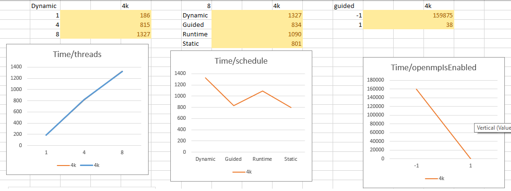

## Лабы по многопоточному программированию
 
### mp1 - OpenMP. Определитель матрицы
Определение детерминанта квадратной матрицы со значениями типа float.
Входной файл содержит данные следующим образом:
n
/* матрица, элементы разделены пробелом */
Пример:
4
1 2 8.8 9.9
3.0 4.0 3.3 4.4
2.0 5.2 2.2 5.5
6.3 7.8 6.3 7.8 
Формат вывода результата: “Determinant: %g\n”
Сравните wall-clock time последовательной и параллельной версий (при различном числе потоков). В данном случае имеется в виду время работы алгоритма (без замера времени на считывание данных и вывод результат).

Использование: ConsoleApplication1.exe <имя_входного_файла> <кол-во_потоков>

### mp2 - OpenMP. Авто контрастность изображения
Необходимо написать программу, позволяющую проводить настройку яркости в пространстве RGB: <смещение> и <множитель> вычисляются на основе минимального и максимального значений пикселей, после игнорирования 0.39% (=1/256) самых светлых и тёмных пикселей (по количеству, а не по значению);
<смещение> - целое число в диапазоне [-255..255];
<множитель> - вещественное положительное число в диапазоне [1/255..255].
Новое значение пикселя X изменяется по формуле: (X-<смещение>)*<множитель>.
Входные/выходные данные: Изображения в формате Netpbm, варианты P5 (оттенки серого) и P6 (RGB). В файлах гарантируется отсутствие комментариев.
Сравните wall-clock time последовательной и параллельной версий (при различном числе потоков). В данном случае имеется в виду время работы алгоритма (без учёта времени на считывание данных, вывод результата и инициализацию OpenMP).

Использование: ConsoleApplication1.exe <имя_входного_файла> <имя_выходного_файла> <кол-во_потоков>

